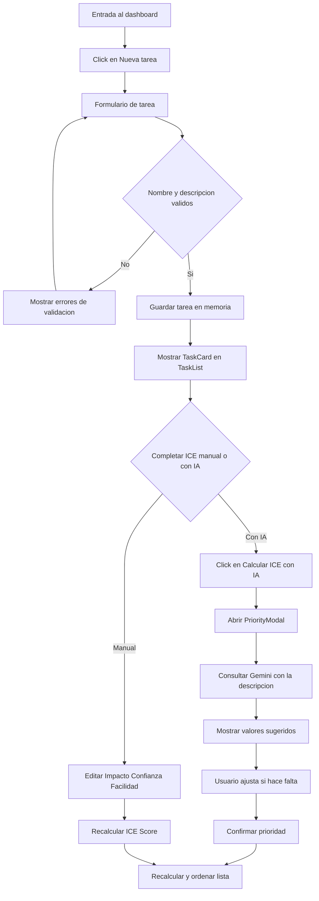
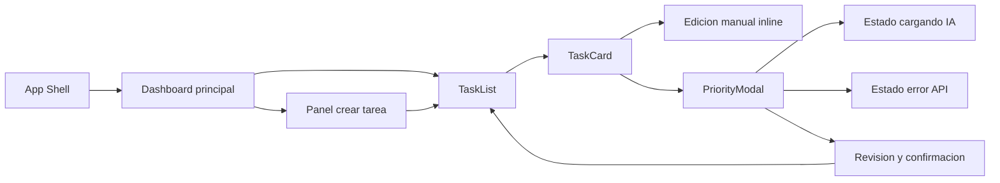
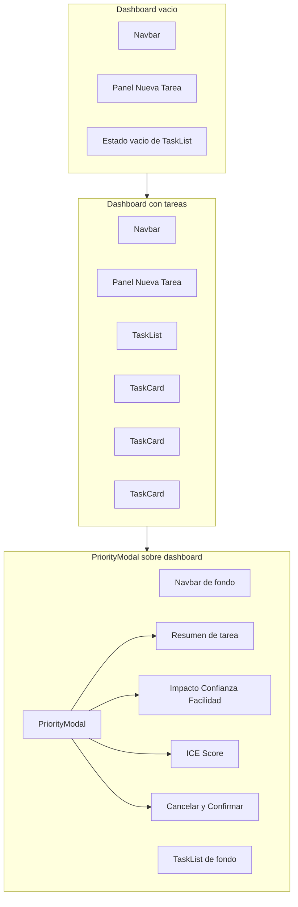

# UX funcional y visual - Gestor de Tareas ICE

## 1. Objetivo del flujo

El MVP debe permitir que una persona entre en la app, cree una tarea, solicite una sugerencia de valores ICE con IA, revise la propuesta y la confirme para que la tarea quede ordenada por prioridad dentro de la lista.

## 2. Flujo de usuario principal

### Entrada a la app

La experiencia arranca en una única pantalla principal tipo dashboard.

- El usuario ve una barra superior simple con el nombre del producto y una acción primaria para crear tarea.
- Debajo, encuentra el área de creación y la lista priorizada de tareas.
- Si todavía no existen tareas, la lista muestra un estado vacío con una llamada a crear la primera tarea.

### Crear una tarea

- El usuario pulsa "Nueva tarea" en la Navbar o interactúa directamente con el formulario visible en pantalla.
- Introduce nombre y descripción, ambos obligatorios.
- Guarda la tarea.
- La nueva tarea aparece al inicio de la TaskList con sus valores ICE vacíos o pendientes de completar.

### Solicitar ICE sugerido por IA

- Desde la TaskCard, el usuario pulsa "Calcular ICE con IA".
- Se abre el PriorityModal.
- El modal muestra el contexto de la tarea, un estado de carga mientras se consulta Gemini y, después, la propuesta de Impacto, Confianza y Facilidad.

### Revisar y confirmar

- El usuario revisa los tres valores sugeridos.
- Puede ajustar manualmente cualquier campo dentro del rango 1 a 10.
- El sistema recalcula el ICE Score en tiempo real.
- El usuario pulsa "Confirmar prioridad".
- La tarea vuelve a la TaskList con el ICE ya aplicado y la lista se reordena de mayor a menor puntuación.

## 3. Jerarquía de pantallas

### Pantalla 1. Dashboard principal

Pantalla base del producto. No hace falta routing complejo en este MVP; puede resolverse como una single-page app con estados internos.

Bloques:

- Navbar superior.
- Panel de creación de tareas.
- TaskList ordenada por ICE.
- Estados vacíos, cargando y error embebidos en la misma vista.

### Pantalla 2. Dashboard con tareas

Es la misma pantalla principal, pero en estado poblado.

Bloques:

- Formulario de alta reducido o plegable.
- Lista de TaskCard con score, campos ICE y acciones.
- Indicador visual de orden por prioridad.

### Pantalla 3. PriorityModal

Overlay modal para revisar la propuesta de IA antes de aplicarla.

Bloques:

- Resumen de tarea.
- Estado de carga de IA.
- Inputs numéricos para Impacto, Confianza y Facilidad.
- Score calculado en vivo.
- Mensajes de error de API o validación.
- Acciones "Cancelar" y "Confirmar prioridad".

## 4. Componentes principales en Material UI

### Navbar

Función:

- Dar contexto a la app y ofrecer la acción primaria.

Base MUI recomendada:

- AppBar
- Toolbar
- Typography
- Button
- Badge opcional para número de tareas

Contenido:

- Nombre "Gestor de Tareas ICE"
- Botón "Nueva tarea"
- Indicador de cantidad de tareas o criterio de orden

### TaskList

Función:

- Mostrar las tareas ordenadas por ICE Score descendente.

Base MUI recomendada:

- Container o Box
- Stack o Grid
- Divider
- Alert para error general
- Skeleton para estados de carga

Comportamiento:

- Estado vacío cuando no hay tareas
- Estado poblado con tarjetas
- Reordenación automática tras cambios de score

### TaskCard

Función:

- Representar una tarea y sus acciones principales.

Base MUI recomendada:

- Card
- CardContent
- CardActions
- Typography
- Chip
- TextField para edición manual rápida
- Button y LoadingButton

Contenido clave:

- Nombre de tarea
- Descripción breve
- Chips o campos para Impacto, Confianza y Facilidad
- ICE Score destacado
- Botón "Calcular ICE con IA"
- Acción secundaria para editar manualmente

### PriorityModal

Función:

- Permitir revisar, corregir y confirmar la prioridad calculada con IA.

Base MUI recomendada:

- Dialog
- DialogTitle
- DialogContent
- DialogActions
- TextField type number
- Alert
- CircularProgress
- Divider
- Stack

Contenido clave:

- Nombre y descripción de la tarea
- Valores sugeridos por IA
- Validación de rango 1 a 10
- ICE Score recalculado en vivo
- Confirmación final antes de aplicar cambios

## 5. Estructura visual recomendada

### Desktop

- Navbar fija arriba.
- Layout a dos columnas.
- Columna izquierda: panel de creación.
- Columna derecha: TaskList priorizada.
- PriorityModal centrado sobre la vista.

### Mobile

- Navbar compacta.
- Formulario encima de la lista.
- TaskCard en una sola columna.
- PriorityModal a pantalla casi completa tipo full-screen dialog.

## 6. Criterios UX importantes

- La acción principal siempre debe ser crear tarea o calcular prioridad.
- El ICE Score debe ser el dato visual más prominente dentro de cada tarjeta.
- La intervención de IA debe sentirse asistida, no automática: siempre hay revisión y confirmación humana.
- Los estados de carga y error deben estar visibles dentro del modal para no romper el flujo.
- La reordenación de la lista debe ocurrir justo después de confirmar, para reforzar la lógica de priorización.

## 7. Diagrama de flujo del proceso de crear tareas



## 8. Diagrama de flujo de la navegacion del usuario



## 9. Imagen estructural de pantallas



---

## 10. Arquitectura React + TypeScript

### 10.1 Estructura de carpetas

La aplicación es una SPA sin routing. Se organiza bajo `src/` distinguiendo tres responsabilidades: tipos, servicios externos y componentes de UI. Se elimina la carpeta `context/` porque el estado vive directamente en `App.tsx`.

```
src/
├── types/
│   └── task.ts                   # Interfaces Task, IceValues (iceScore excluido del tipo)
│
├── hooks/
│   └── useIceAi.ts               # Lógica async de llamada a Gemini
│
├── services/
│   └── geminiService.ts          # Función que llama a la API de Gemini
│
├── utils/
│   └── iceUtils.ts               # calculateIce() y sortByIce() en un módulo único
│
├── components/
│   ├── layout/
│   │   └── Navbar.tsx            # AppBar con título y contador de tareas (prop)
│   │
│   ├── tasks/
│   │   ├── TaskForm.tsx          # Formulario de alta: nombre + descripción
│   │   ├── TaskList.tsx          # Lista; aplica sortByIce con useMemo
│   │   ├── TaskCard.tsx          # Tarjeta: coordinador visual y de acciones
│   │   └── TaskCardIceEditor.tsx # Subcomponente de edición inline de campos ICE
│   │
│   ├── modal/
│   │   └── PriorityModal.tsx     # Dialog MUI que orquesta revisión y confirmación
│   │
│   └── ui/
│       ├── IceField.tsx          # TextField numérico reutilizable con validación 1–10
│       ├── IceScoreDisplay.tsx   # Bloque visual del score calculado en vivo
│       ├── EmptyState.tsx        # Estado vacío de la lista
│       ├── LoadingOverlay.tsx    # CircularProgress dentro del modal
│       └── ErrorAlert.tsx        # Alert de error de API o validación
│
├── App.tsx                       # Raíz: useState para tasks y selectedTaskId + layout
└── main.tsx                      # Punto de entrada Vite/React
```

---

### 10.2 División en componentes

Cada componente tiene una única responsabilidad. El árbol de composición refleja la jerarquía de pantallas definida en la sección 3.

#### App.tsx

- Gestiona el estado con dos `useState`: `tasks: Task[]` y `selectedTaskId: string | null`.
- Define cuatro funciones de actualización (`addTask`, `updateIce`, `openModal`, `closeModal`) y las pasa por props.
- Compone `Navbar`, `TaskForm` y `TaskList` en el grid de dos columnas.
- Renderiza `PriorityModal` fuera del grid para que actúe como overlay global.
- Sin `Provider`: la indirección de Context no está justificada para dos campos de estado.

#### Navbar

- Recibe `taskCount: number` por prop para el contador.
- No conoce el estado del formulario ni emite eventos de apertura; esa responsabilidad queda en `App`.

#### TaskForm

- Estado local para los campos de nombre y descripción.
- Valida presencia de ambos campos antes de llamar al callback `onAddTask` recibido por prop.
- Tras guardar, limpia el formulario y transfiere el foco.

#### TaskList

- Recibe `tasks: Task[]` por prop en orden de inserción.
- Deriva la lista ordenada internamente con `useMemo(() => sortByIce(tasks), [tasks])`. La prop original no se muta.
- Si la lista derivada está vacía, muestra `EmptyState`.
- Itera y renderiza un `TaskCard` por tarea.

#### TaskCard

- Recibe `task: Task`, `onUpdateIce` y `onOpenModal` por prop.
- Actúa como coordinador visual: compone `TaskCardIceEditor` e `IceScoreDisplay`.
- El botón "Calcular ICE con IA" llama a `onOpenModal(task.id)`.
- No contiene estado de formulario propio; lo delega a `TaskCardIceEditor`.

#### TaskCardIceEditor

- Subcomponente interno de `TaskCard` para la edición inline de Impacto, Confianza y Facilidad.
- Gestiona estado local de los tres campos y expone un botón de confirmación que llama a `onUpdateIce`.
- Aísla la lógica de edición inline para que `TaskCard` no mezcle responsabilidades.

#### PriorityModal

- Recibe `task: Task | null`, `onUpdateIce` y `onClose` por prop.
- Se abre cuando `task` es distinta de `null`; se cierra llamando a `onClose`.
- Llama a `useIceAi` al montarse para obtener los valores sugeridos.
- Muestra `LoadingOverlay` durante la llamada y `ErrorAlert` si falla.
- Contiene tres `IceField` y un `IceScoreDisplay` que recalcula el score con `calculateIce` en tiempo real.
- "Confirmar prioridad" llama a `onUpdateIce` y después a `onClose`.

#### IceField

- `TextField` type `number` de MUI.
- Valida valor entre 1 y 10 en `onChange`.
- Muestra error visual si está fuera de rango.
- Reutilizado en `TaskCard` (edición inline) y `PriorityModal` (revisión sugerida).

---

### 10.3 Gestión del estado

El estado vive en `App.tsx` con `useState`. No se usa `useReducer`, Context ni ninguna librería externa.

#### Estado en App.tsx

```
const [tasks, setTasks] = useState<Task[]>([])
const [selectedTaskId, setSelectedTaskId] = useState<string | null>(null)
```

Ambas variables se pasan hacia abajo por props. No hay Provider ni suscriptores globales.

#### Tipo Task

```
Task {
    id: string                  # crypto.randomUUID()
    name: string
    description: string
    impact: number | null       # null hasta que se asigne un valor
    confidence: number | null
    ease: number | null
    # iceScore NO se almacena: se calcula con calculateIce() en el punto de uso
}
```

`iceScore` es un valor derivado. Se obtiene en el momento de renderizar llamando a `calculateIce(impact, confidence, ease)` de `iceUtils.ts`. Almacenarlo en el tipo introduciría riesgo de desincronización entre los campos base y el score.

#### Funciones de actualización de estado

Definidas en `App.tsx` y pasadas por props a los componentes que las necesitan:

| Función    | Firma                                         | Efecto                                                  |
|------------|-----------------------------------------------|---------------------------------------------------------|
| addTask    | `(name, description) => void`                 | Crea una Task con campos ICE a null y la añade al array |
| updateIce  | `(id, impact, confidence, ease) => void`      | Actualiza los tres campos de la tarea con ese id        |
| openModal  | `(id) => void`                                | Establece selectedTaskId                                |
| closeModal | `() => void`                                  | Pone selectedTaskId a null                              |

#### Hook useIceAi

- Estado local: `status: 'idle' | 'loading' | 'success' | 'error'` y `suggestion: IceValues | null`.
- Al llamar a `fetchSuggestion(description)` invoca `geminiService`, actualiza status y suggestion.
- El estado de carga y error permanece local al modal; no sube al estado de `App`.
- `PriorityModal` consume este hook directamente para orquestar el ciclo de IA.

#### Flujo de datos resumido

```
App (useState: tasks, selectedTaskId)
 ├─ Navbar             ← taskCount (prop)
 ├─ TaskForm           ← onAddTask (prop)
 ├─ TaskList           ← tasks, onUpdateIce, onOpenModal (props)
 │   └─ TaskCard       ← task, onUpdateIce, onOpenModal (props)
 │       └─ TaskCardIceEditor ← impact, confidence, ease, onUpdateIce (props)
 └─ PriorityModal      ← task, onUpdateIce, onClose (props)
            └─ useIceAi ──── geminiService ──── Gemini API
```

La ordenación no es parte del estado. `TaskList` deriva la lista ordenada con `useMemo(() => sortByIce(tasks), [tasks])` y la usa solo para renderizar. El array original en `App` mantiene el orden de inserción.

---

## 11. Análisis crítico de la arquitectura

Este análisis contrasta la arquitectura propuesta con el alcance real del MVP: sin backend, sin persistencia, sin autenticación, sin routing. El criterio de evaluación es si cada decisión de diseño está justificada por la complejidad del problema o introduce sobrecarga innecesaria.

---

### Problema 1. useReducer + Context es sobredimensionado para este estado

**Diagnóstico — sobrediseño**

El estado global tiene exactamente dos campos: `tasks[]` y `selectedTaskId`. Con cuatro acciones simples y sin lógica derivada compleja, un `useReducer` dentro de un Context añade indirección sin aportar ventaja real. Para este volumen de datos, `useState` en `App.tsx` pasado por props directas habría sido suficiente, más legible y sin introducir el patrón Context a alumnos que están aprendiendo.

**Riesgo concreto**: si en el futuro el Context se suscribe en muchos nodos del árbol, cualquier cambio en `tasks` (por ejemplo, cada pulsación de tecla en `IceField` al editar inline) provoca un re-render en cascada de todos los consumidores, incluido `Navbar`, que solo necesita el conteo.

**Recomendación**: para este MVP, usar `useState` en `App.tsx` y paso de props. Si el proyecto crece, migrar a Context en ese momento con la complejidad ya justificada.

---

### Problema 2. IceScoreDisplay está mal ubicado en la carpeta modal/

**Diagnóstico — acoplamiento estructural**

`IceScoreDisplay` vive en `components/modal/` pero la descripción lo usa tanto dentro de `PriorityModal` como dentro de `TaskCard`. Un componente de presentación pura compartido entre dos zonas de la UI no debería estar dentro de la carpeta de un componente concreto; eso crea una dependencia de importación desde `tasks/` hacia `modal/`, lo que invierte la jerarquía esperada.

**Recomendación**: moverlo a `components/ui/` junto con `IceField`, `EmptyState`, `LoadingOverlay` y `ErrorAlert`, que son los componentes verdaderamente reutilizables y sin dueño.

---

### Problema 3. iceScore como campo derivado almacenado en el tipo Task

**Diagnóstico — estado derivado redundante**

`iceScore` se define como campo del tipo `Task` y se recalcula en el reducer al ejecutar `UPDATE_ICE`. Esto significa que existe dos fuentes de la misma verdad: los tres campos base y el score calculado. Si en algún momento `impact`, `confidence` o `ease` se modifican sin pasar por `UPDATE_ICE` se produce una inconsistencia silenciosa.

**Recomendación**: calcular `iceScore` siempre en `calculateIce.ts` como función pura y no almacenarlo en el estado. Computarlo en el momento de renderizar o al ordenar con `sortByIce`. Esto elimina la clase de bug de "score desincronizado" y simplifica el reducer.

---

### Problema 4. TaskCard mezcla edición inline y apertura de modal

**Diagnóstico — responsabilidad doble**

`TaskCard` hace dos cosas funcionalmente distintas: edición directa de campos ICE y apertura del modal de IA. Esto implica que contiene estado local de formulario (tres `IceField` controlados), lógica de despacho al reducer y conocimiento del sistema de modal. Si cualquiera de los dos flujos cambia, hay que modificar la misma clase.

**Riesgo concreto**: si se decide que la edición inline deba validar de forma diferente a la del modal, la lógica de `IceField` empieza a bifurcarse dentro del mismo componente.

**Recomendación**: extraer `TaskCardIceEditor` como subcomponente interno que gestione los tres campos y el recalculo local, y dejar `TaskCard` exclusivamente como contenedor visual y coordinador de acciones.

---

### Problema 5. sortByIce se aplica en el hook, no en el reducer

**Diagnóstico — ordenación con efecto secundario oculto**

Según la especificación, `useTasks` devuelve las tareas ya ordenadas por `sortByIce`. Esto significa que el array que ve el componente es diferente del array que hay en el estado del reducer. Si algún componente necesita el índice estable de una tarea (por ejemplo, para animaciones de reordenación) encontrará que los índices no corresponden al estado real y que cada render puede reordenar el array.

**Recomendación**: dejar el array en el estado en orden de inserción y aplicar la ordenación solo en `TaskList` mediante `useMemo`, siendo explícito en el punto donde se produce la transformación. Así el estado es predecible y la ordenación es visible en el nodo que la necesita.

---

### Problema 6. Navbar acopla lógica de apertura de formulario

**Diagnóstico — acoplamiento entre layout y lógica de negocio**

La descripción indica que Navbar "emite un evento para que App abra el formulario si está colapsado". Esto implica que Navbar conoce el estado colapsado del formulario, que ese estado existe en App y que hay un callback que fluye de App hacia Navbar solo para esta acción. Para un MVP donde el formulario podría estar siempre visible, este mecanismo añade complejidad sin valor demostrable.

**Recomendación**: si el formulario está siempre visible en desktop (como muestran los mockups), eliminar el estado colapsado del MVP. Si se necesita en mobile, tratarlo como estado local de `App` con un prop sencillo, sin que Navbar conozca la semántica del formulario.

---

### Problema 7. utils/ tiene dos archivos con una sola línea de lógica cada uno

**Diagnóstico — fragmentación prematura**

`calculateIce.ts` implementa una multiplicación de tres factores. `sortByIce.ts` implementa un `.sort()` por un campo. Tener un módulo separado para cada operación de una línea introduce overhead de importación y navegación sin ninguna ganancia de cohesión. Estos dos archivos solo estarían justificados si tuvieran tests propios o si la lógica fuera suficientemente compleja para justificar el aislamiento.

**Recomendación**: unificar ambas funciones en un solo `iceUtils.ts` o colocarlas en `task.ts` como funciones auxiliares del mismo módulo de tipos. Si se escriben tests unitarios, se puede extraer en ese momento.

---

### Resumen de hallazgos

| # | Problema | Tipo | Impacto | Acción recomendada |
|---|----------|------|---------|--------------------|
| 1 | useReducer + Context sobredimensionado | Sobrediseño | Alto | useState + props para este MVP |
| 2 | IceScoreDisplay mal ubicado en modal/ | Acoplamiento estructural | Medio | Moverlo a ui/ |
| 3 | iceScore almacenado como estado derivado | Estado redundante | Alto | Calcularlo siempre desde los tres campos base |
| 4 | TaskCard con doble responsabilidad | SRP violado | Medio | Extraer TaskCardIceEditor como subcomponente |
| 5 | sortByIce aplicado en el hook, no en TaskList | Efecto oculto en datos | Medio | Ordenar con useMemo en TaskList |
| 6 | Navbar acoplada al estado del formulario | Acoplamiento innecesario | Bajo | Eliminar estado colapsado del MVP |
| 7 | calculateIce y sortByIce como archivos separados | Fragmentación prematura | Bajo | Unificar en iceUtils.ts |